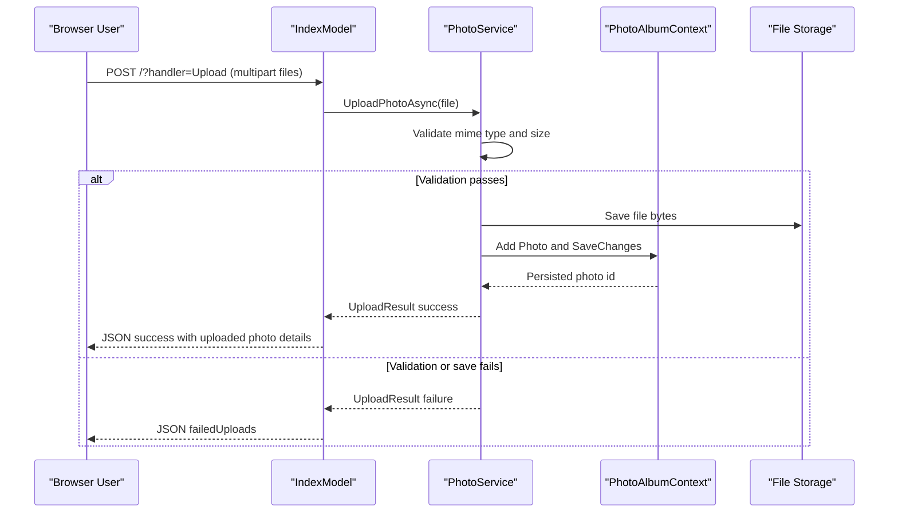

# API & Service Communication Contracts

The application exposes a small HTTP surface through Razor Pages handlers with synchronous, in-process service calls and no inter-service networking. Contracts are primarily page handler inputs/outputs and JSON responses for uploads.

## Service Catalog

| Service | Port | Category | Purpose |
|---|---|---|---|
| PhotoAlbum (Razor Pages web app) | 5000/5001 (development defaults) | API Layer + Business | Serves UI, upload endpoint, detail and file retrieval flows |

## API Endpoints Inventory

| Service | Method | Path | Request Type | Response Type |
|---|---|---|---|---|
| PhotoAlbum | GET | `/` | None | HTML page with gallery model |
| PhotoAlbum | POST | `/?handler=Upload` | `List<IFormFile>` multipart form-data | JSON `{success, uploadedPhotos, failedUploads}` |
| PhotoAlbum | GET | `/Detail?id={id}` | Query parameter `id` | HTML detail page or 404 |
| PhotoAlbum | POST | `/Detail?handler=Delete` | Form/query parameter `id` | Redirect to `/` |
| PhotoAlbum | GET | `/PhotoFile?id={id}` | Query parameter `id` | File bytes (`photo.MimeType`) or 404/500 |

## Management & Observability Endpoints

| Service | Endpoint | Custom Metrics (if any) |
|---|---|---|
| PhotoAlbum | None explicitly configured | None detected |

## DTOs & Contracts

The API surface relies on domain-centric models and anonymous JSON payloads rather than dedicated request/response DTO classes. `Photo` acts as the response model for page rendering, while upload uses framework-provided `IFormFile` request contracts and returns anonymous JSON payload objects. No OpenAPI/Swagger, protobuf, or GraphQL contract artifacts were detected.

## Communication Patterns

All communication is synchronous within a single process: Razor PageModels call `IPhotoService`, which persists metadata via EF Core and accesses local disk for file binaries. No asynchronous messaging, service discovery, API gateway, circuit breaker, retry policy, or timeout policy frameworks were found. Security posture is minimal at API-contract level: no authentication/authorization middleware is configured, and TLS behavior depends on hosting environment defaults.

## Service Technology Matrix

| Service | Web | Data Access | Discovery | Gateway | Actuator | Cache | Metrics |
|---|---|---|---|---|---|---|---|
| PhotoAlbum | Razor Pages | EF Core SqlServer | None | None | None | File/HTTP cache headers only | Logging only |

## Service Communication Sequence

