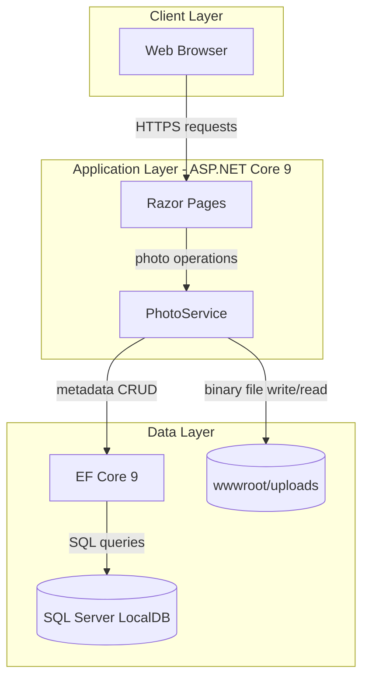
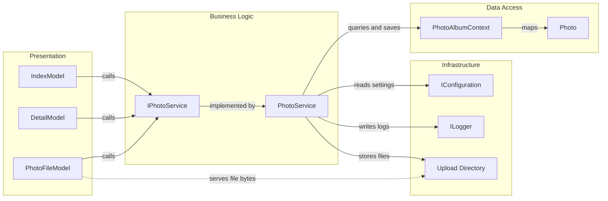

# Architecture Diagram

PhotoAlbum is a single-service web application with server-rendered UI and a local persistence + file storage model. The architecture below summarizes runtime layers and the main internal component interactions.

## Application Architecture



### Technology Stack Summary

| Layer | Technology | Version | Purpose |
|---|---|---|---|
| Presentation | ASP.NET Core Razor Pages | 9.0 | Server-rendered UI and handlers |
| Business | PhotoService | N/A | Upload, retrieval, delete orchestration |
| Data Access | EF Core SqlServer | 9.0.9 | Persist photo metadata |
| Media Processing | SixLabors.ImageSharp | 3.1.11 | Read image dimensions |
| Storage | SQL Server LocalDB + local file system | N/A | Metadata + image binary storage |

### Data Storage & External Services

The app stores photo metadata in SQL Server LocalDB via EF Core and stores uploaded binaries on the local file system under `wwwroot/uploads`. No external APIs, message brokers, or cloud-managed services are configured in the current implementation.

### Key Architectural Decisions

- Uses a service-layer abstraction (`IPhotoService`) between Razor handlers and persistence/storage logic.
- Splits metadata and binary storage to keep relational data lean while storing files on disk.
- Applies startup EF migrations automatically outside the explicit test environment flag.

## Component Relationships



### Component Inventory

| Component | Layer | Type | Responsibility |
|---|---|---|---|
| IndexModel | Presentation | Razor PageModel | Gallery list and upload endpoint |
| DetailModel | Presentation | Razor PageModel | Single photo view and delete action |
| PhotoFileModel | Presentation | Razor PageModel | Indirect secure-ish file serving |
| IPhotoService | Business | Service Contract | Defines photo operations |
| PhotoService | Business | Service | Validates uploads and coordinates DB/files |
| PhotoAlbumContext | Data Access | DbContext | EF Core access to `Photos` table |
| Photo | Data Access | Entity | Photo metadata model |
```
