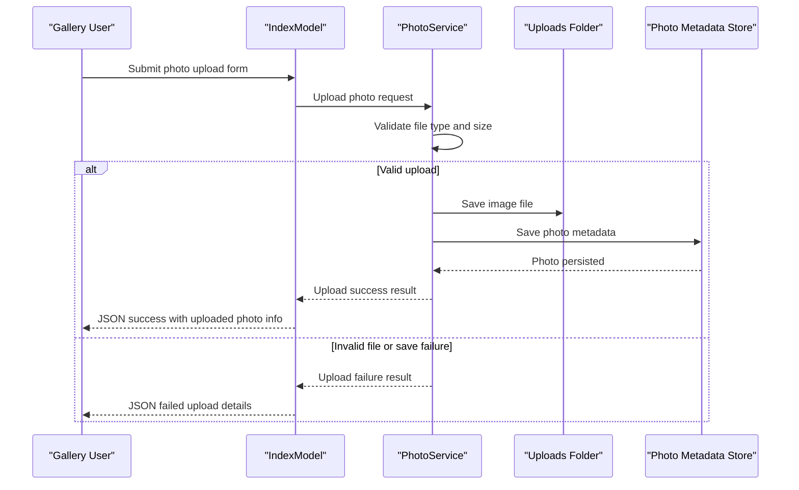

# Core Business Workflows

The application supports a focused photo-management domain where users upload images, browse gallery content, view details, and delete entries. The workflows combine validation, persistence, and file-system operations to keep metadata and binaries consistent.

## Domain Entities

| Entity | Service / Bounded Context | Description | Key Relationships |
|---|---|---|---|
| Photo | Photo Management | Represents one uploaded image and its metadata | Central entity for upload, list, detail, and delete workflows |
| UploadResult | Photo Management | Encapsulates upload outcome and error details | Produced by service and consumed by upload handler response |

## Service-to-Domain Mapping

| Service | Domain Context | Owned Entities | External Dependencies |
|---|---|---|---|
| Razor PageModels (`IndexModel`, `DetailModel`, `PhotoFileModel`) | User Interaction | View-facing photo projection | `IPhotoService` |
| `PhotoService` | Photo Lifecycle Management | Photo, UploadResult handling logic | EF Core DbContext, local file storage, ImageSharp |
| `PhotoAlbumContext` | Metadata Persistence | Photo metadata aggregate | SQL Server LocalDB |

## Primary Workflows

### Workflow 1: Upload Photos to Gallery

1. User submits files via `POST /?handler=Upload`.
2. `IndexModel` iterates files and calls `PhotoService.UploadPhotoAsync`.
3. Service validates MIME type, file size, and non-empty payload.
4. Service extracts image dimensions, writes file to disk, then writes metadata to DB.
5. On DB failure, service deletes the newly saved file (rollback behavior).
6. Handler returns JSON with successful and failed upload entries.

### Workflow 2: View Photo Details and Navigate

1. User opens `GET /Detail?id={id}`.
2. `DetailModel` loads all photos, resolves target photo, and calculates adjacent IDs.
3. Page renders metadata and previous/next navigation.

### Workflow 3: Delete Photo

1. User triggers delete via `POST /Detail?handler=Delete`.
2. `DetailModel` calls `PhotoService.DeletePhotoAsync`.
3. Service attempts file deletion, then removes metadata record.
4. User is redirected to gallery; failures are logged and surfaced via temp error message.

## Cross-Service Data Flows

This is a single-service application, so no inter-service composition or gateway aggregation exists. Data flow is internal: page handler → service logic → DB/file system. Degradation behavior is local (for example, if dimension extraction fails, upload can still proceed without width/height metadata).

## Business Workflow Sequence

## Business Rules & Decision Logic

- Upload acceptance requires allowed MIME type, positive file length, and size under configured limit.
- Metadata persistence failure triggers compensating action (delete saved file) to preserve consistency.
- Detail workflow returns not found for missing IDs rather than rendering partial records.
- Delete workflow prioritizes metadata removal even if file deletion fails, with errors logged for cleanup visibility.
