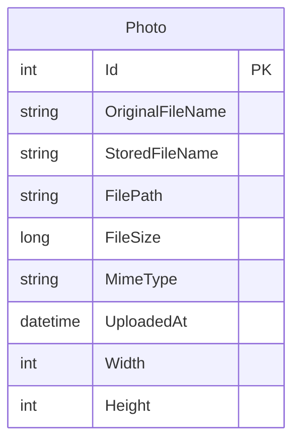

# Data Architecture & Persistence Layer

The data layer is centered on one relational entity persisted through EF Core with SQL Server LocalDB, paired with local file storage for image binaries. Persistence responsibilities are concentrated in a single DbContext and service.

## Database Configuration

| Service/Module | DB Type | Profile | Driver | Connection | Migration Tool |
|---|---|---|---|---|---|
| PhotoAlbum | SQL Server LocalDB | Default runtime config | Microsoft.EntityFrameworkCore.SqlServer | LocalDB connection string in appsettings | EF Core migrations (`Database.MigrateAsync`) |

## Data Ownership per Service

| Service | Tables Owned | ORM Framework | Caching | Notes |
|---|---|---|---|---|
| PhotoAlbum | Photos | EF Core | None at data layer | Single schema ownership; binary files stored outside DB |

## Entity Model

## Key Repository Methods

| Service | Repository | Notable Methods | Purpose |
|---|---|---|---|
| PhotoAlbum | `PhotoAlbumContext` (`DbSet<Photo>`) | `FindAsync(id)`, `AddAsync(photo)`, `SaveChangesAsync()`, ordered query on `UploadedAt` | Retrieve, create, delete photo metadata with chronological listing |

## Caching Strategy

No dedicated data-cache provider is configured (no Redis/MemoryCache annotations or second-level EF cache). Caching appears at HTTP/static-file level via response cache headers rather than persistence/query result caching.

## Data Ownership Boundaries

The application uses a single service and single relational datastore for metadata ownership; there are no cross-service data boundaries or inter-service data access patterns. Reads and writes are performed directly through the same DbContext, with file-system binary content managed in parallel by `PhotoService`.

### Data Classification & Sensitivity

| Entity | Sensitive Fields | Classification (PII/PHI/PCI/None) | Controls in Place |
|---|---|---|---|
| Photo | OriginalFileName (may contain user naming context) | Low sensitivity / potential indirect PII | No explicit field-level masking or encryption controls in code |

