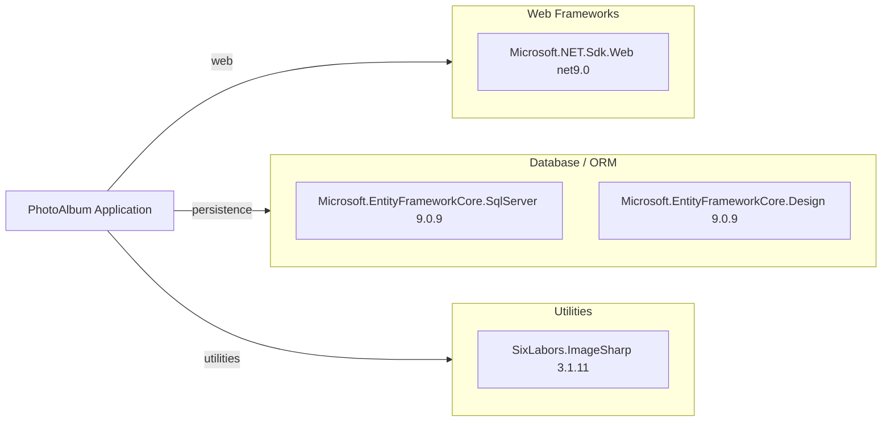

# Dependency Map

This .NET solution declares a compact dependency set centered on ASP.NET Core web delivery, EF Core SQL Server persistence, and image processing, with a separate test dependency stack.

## Dependencies

### Dependency Summary

| Category | Count | Key Libraries | Notes |
|---|---:|---|---|
| Web Frameworks | 1 | ASP.NET Core Web SDK | Razor Pages application hosting |
| Database / ORM | 2 | EF Core SqlServer, EF Core Design | Relational persistence and migrations |
| Utilities | 1 | ImageSharp | Image metadata extraction |

### Version & Compatibility Risks

The application targets `.NET 9.0`, which is current but not an LTS target; migration planning toward the next LTS or organizational target (requested net10.0 assessment) should be tracked. EF Core and ASP.NET Core package versions are aligned at 9.0.9, reducing intra-stack version mismatch risk.

### Notable Observations

- Dependency footprint is intentionally small, lowering modernization complexity.
- No explicit messaging, caching, or observability package dependencies are declared.
- File storage is handled through platform APIs rather than an external storage SDK.

## Test Dependencies

| Framework | Version | Notes |
|---|---|---|
| xUnit | 2.9.2 | Unit/integration test framework |
| xunit.runner.visualstudio | 2.8.2 | Visual Studio test runner integration |
| Microsoft.NET.Test.Sdk | 17.12.0 | .NET test host |
| coverlet.collector | 6.0.2 | Code coverage collector |
| Microsoft.AspNetCore.Mvc.Testing | 9.0.9 | In-process web integration testing |
| Microsoft.EntityFrameworkCore.InMemory | 9.0.9 | Test-time in-memory DB provider |

Total test-scope dependencies: 6
Test infrastructure is modern and sufficient for current coverage, though there is no dedicated contract-testing or containerized integration framework.
